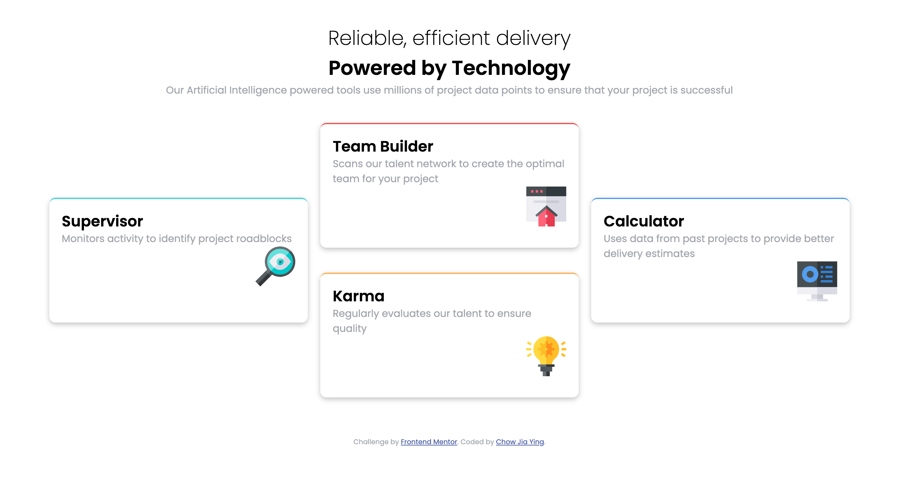

# Frontend Mentor - Four card feature section solution

This is a solution to the [Four card feature section challenge on Frontend Mentor](https://www.frontendmentor.io/challenges/four-card-feature-section-weK1eFYK). Frontend Mentor challenges help you improve your coding skills by building realistic projects.

## Table of contents

- [Frontend Mentor - Four card feature section solution](#frontend-mentor---four-card-feature-section-solution)
  - [Table of contents](#table-of-contents)
  - [Overview](#overview)
    - [The challenge](#the-challenge)
    - [Screenshot](#screenshot)
    - [Links](#links)
  - [My process](#my-process)
    - [Built with](#built-with)
    - [What I learned](#what-i-learned)
      - [Semantic HTML5 markup](#semantic-html5-markup)
    - [Useful resources](#useful-resources)
  - [Author](#author)

**Note: Delete this note and update the table of contents based on what sections you keep.**

## Overview

### The challenge

Users should be able to:

- View the optimal layout for the site depending on their device's screen size

### Screenshot

### Links

- [Solution URL](https://github.com/C-likethis123/four-card-feature-section-master)
- [Live Site URL](https://c-likethis123.github.io/four-card-feature-section-master)

## My process

### Built with

- Semantic HTML5 markup
- CSS Grid
- Mobile-first workflow

### What I learned

#### Semantic HTML5 markup

I challenged myself to use semantic HTML5 as opposed to putting everything in divs.
So I learnt about the `<main>` and `<section>` tags. To better understand semantic HTML5, I visited examples of landing pages.

I also learnt about the "hero" section of the page, which is typically a prominent image, slider or text element.

### Useful resources

- [CSS Grid Tutorial from Mozilla Docs](https://developer.mozilla.org/en-US/docs/Web/CSS/CSS_Grid_Layout) - This helped me better understand CSS Grid. I will continue to apply the concepts taught in this tutorial.

## Author

- Website - [Chow Jia Ying](http://c-likethis123.github.io/website)
- Frontend Mentor - [@C-likethis123](https://www.frontendmentor.io/profile/C-likethis123)
